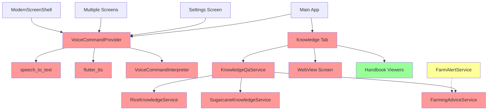

# Plan: Remove AI Capabilities from RCAMARii Project

## Overview
This plan outlines the complete removal of AI-related features from the RCAMARii farm management application, including voice commands, voice responses, and the Knowledge Q&A system.

---

## AI Components Identified

### 1. Voice Command System
**Files to Remove:**
- [`lib/providers/voice_command_provider.dart`](lib/providers/voice_command_provider.dart) - Main voice command provider (726 lines)
- [`lib/services/voice_command_interpreter.dart`](lib/services/voice_command_interpreter.dart) - Command interpretation logic

**Technologies Used:**
- `speech_to_text` package for voice recognition
- `flutter_tts` package for text-to-speech responses

**Integration Points:**
- Main app initialization in [`lib/main.dart`](lib/main.dart)
- Various screens with voice buttons
- Settings for enabling/disabling voice features

---

### 2. Knowledge/Q&A System
**Files to Remove:**
- [`lib/screens/tab_knowledge.dart`](lib/screens/tab_knowledge.dart) - Knowledge tab UI (1391 lines)
- [`lib/services/knowledge_qa_service.dart`](lib/services/knowledge_qa_service.dart) - Q&A service
- [`lib/models/knowledge_qa_model.dart`](lib/models/knowledge_qa_model.dart) - Q&A data model
- [`lib/services/rice_knowledge_service.dart`](lib/services/rice_knowledge_service.dart) - Rice farming knowledge
- [`lib/services/sugarcane_knowledge_service.dart`](lib/services/sugarcane_knowledge_service.dart) - Sugarcane knowledge
- [`lib/services/farming_advice_service.dart`](lib/services/farming_advice_service.dart) - Farming advice

**Related Screens:**
- [`lib/screens/webview_screen.dart`](lib/screens/webview_screen.dart) - Knowledge Center webview (may need review for other uses)
- [`lib/screens/handbook_viewer_screen.dart`](lib/screens/handbook_viewer_screen.dart) - PDF handbook viewer (KEEP - useful for viewing handbooks)
- [`lib/screens/pdf_handbook_viewer_screen.dart`](lib/screens/pdf_handbook_viewer_screen.dart) - PDF viewer (KEEP)

---

### 3. Voice/AI UI Elements in Screens

**Files to Modify:**

1. **[`lib/screens/frm_main.dart`](lib/screens/frm_main.dart)**
   - Remove Knowledge tab from navigation (line 29, 59)
   - Remove voice menu action (lines 263-266, 624-625)
   - Remove `_FrmMainOverflowAction.voice` enum value (line 632)
   - Update tab indices after removing Knowledge tab

2. **[`lib/widgets/modern_screen_shell.dart`](lib/widgets/modern_screen_shell.dart)**
   - Remove `onVoiceCommand` parameter (line 13)
   - Remove `showVoiceButton` parameter (line 15)
   - Remove voice button logic (lines 76-78, 178-185)

3. **[`lib/screens/scr_tracker.dart`](lib/screens/scr_tracker.dart)**
   - Remove voice button from app bar (lines 284-287)
   - Remove VoiceCommandProvider import and usage (lines 13, 245-246)

4. **[`lib/screens/frm_logistics.dart`](lib/screens/frm_logistics.dart)**
   - Remove voice button from headers (lines 1344-1346)
   - Remove VoiceCommandProvider import and usage (lines 14, 1010-1011, 1081-1082, 1313)

5. **[`lib/screens/scr_msoft.dart`](lib/screens/scr_msoft.dart)**
   - Remove voice button (lines 1102-1103)
   - Remove voice response functionality (lines 262-263)
   - Remove VoiceCommandProvider import (line 16)

6. **[`lib/screens/help_screen.dart`](lib/screens/help_screen.dart)**
   - Remove voice status indicators (lines 43-52, 54-55)
   - Remove voice assistant help text (lines 144, 346-357)

7. **[`lib/screens/settings_screen.dart`](lib/screens/settings_screen.dart)**
   - Remove "Voice Assistant" toggle (lines 596-604)
   - Remove "Spoken Responses" toggle (lines 605-610)
   - Remove voice-related volume check (lines 1137-1138)

---

### 4. Provider and Settings Changes

**[`lib/providers/app_settings_provider.dart`](lib/providers/app_settings_provider.dart)**

Remove the following:
- `_voiceAssistantEnabledKey` constant (line 172-173)
- `_voiceResponsesEnabledKey` constant (line 174-175)
- `_voiceAssistantEnabled` field (line 193)
- `_voiceResponsesEnabled` field (line 194)
- `voiceAssistantEnabled` getter (line 213)
- `voiceResponsesEnabled` getter (line 214)
- `setVoiceAssistantEnabled()` method (lines 315-321)
- `setVoiceResponsesEnabled()` method (lines 323-329)
- Voice settings loading in `_load()` method (lines 404-407)

---

### 5. App Defaults Service

**[`lib/services/app_defaults_service.dart`](lib/services/app_defaults_service.dart)**

Remove:
- `knowledgeSelectedCategoryKey` constant (lines 13-14)
- Voice assistant defaults (lines 25-26)
- Knowledge category default (line 40)

---

### 6. Main App Initialization

**[`lib/main.dart`](lib/main.dart)**

Remove:
- VoiceCommandProvider import (line 38)
- VoiceCommandProvider from MultiProvider (line 85)

---

### 7. Dependencies to Remove

**[`pubspec.yaml`](pubspec.yaml)**

Remove these packages:
```yaml
speech_to_text: ^7.3.0        # Line 41
flutter_tts: ^4.2.5           # Line 42
```

**Note:** Keep `webview_flutter` packages if used elsewhere; review usage first.

---

### 8. Audio Assets to Remove

**Directory: `lib/assets/audio/`**

Remove these files:
- `funny_knowledge.mp3`
- `serious_knowledge.mp3`

**Note:** Keep other audio files for general app sounds and alerts.

---

### 9. Localization Cleanup

**[`lib/services/app_localization_service.dart`](lib/services/app_localization_service.dart)**

Remove localization strings for:
- "Voice" / "Voice Assistant" / "Spoken Responses"
- "Voice ready" / "Voice is off"
- Knowledge-related strings
- Voice help messages (lines 130-131, 350-351)

---

## Implementation Strategy

### Phase 1: Documentation & Backup
1. ✅ Document all AI components
2. Create backup of current state
3. Identify all integration points

### Phase 2: Remove Core AI Components
1. Remove voice command provider file
2. Remove voice command interpreter service
3. Remove all knowledge service files
4. Remove knowledge data models
5. Remove knowledge tab screen

### Phase 3: Update UI Components
1. Remove Knowledge tab from main navigation
2. Remove voice buttons from all screens
3. Update modern_screen_shell widget
4. Remove voice menu actions

### Phase 4: Clean Settings & Configuration
1. Remove voice settings from app_settings_provider
2. Remove AI defaults from app_defaults_service
3. Update main.dart provider initialization

### Phase 5: Remove Dependencies & Assets
1. Remove speech_to_text and flutter_tts from pubspec.yaml
2. Remove AI-related audio files
3. Clean up localization strings

### Phase 6: Testing & Verification
1. Run `flutter clean`
2. Run `flutter pub get`
3. Verify app compiles without errors
4. Test all remaining features work correctly
5. Verify no broken imports or references

---

## Files Summary

### Files to DELETE (14 files):
1. `lib/providers/voice_command_provider.dart`
2. `lib/services/voice_command_interpreter.dart`
3. `lib/screens/tab_knowledge.dart`
4. `lib/services/knowledge_qa_service.dart`
5. `lib/models/knowledge_qa_model.dart`
6. `lib/services/rice_knowledge_service.dart`
7. `lib/services/sugarcane_knowledge_service.dart`
8. `lib/services/farming_advice_service.dart`
9. `lib/assets/audio/funny_knowledge.mp3`
10. `lib/assets/audio/serious_knowledge.mp3`
11. `lib/screens/webview_screen.dart` (if only used for knowledge)

### Files to MODIFY (10+ files):
1. `lib/main.dart` - Remove provider
2. `lib/screens/frm_main.dart` - Remove tab & voice action
3. `lib/widgets/modern_screen_shell.dart` - Remove voice button
4. `lib/screens/scr_tracker.dart` - Remove voice UI
5. `lib/screens/frm_logistics.dart` - Remove voice UI
6. `lib/screens/scr_msoft.dart` - Remove voice UI
7. `lib/screens/help_screen.dart` - Remove voice help
8. `lib/screens/settings_screen.dart` - Remove voice settings
9. `lib/providers/app_settings_provider.dart` - Remove voice state
10. `lib/services/app_defaults_service.dart` - Remove AI defaults
11. `pubspec.yaml` - Remove dependencies
12. `lib/services/app_localization_service.dart` - Remove AI strings

---

## Risk Assessment

### Low Risk
- Voice command removal (isolated component)
- Knowledge tab removal (self-contained feature)

### Medium Risk
- Settings provider modifications (ensure no breaking changes)
- Navigation changes (verify tab indices are correct)

### Verification Required
- Check if webview_flutter is used elsewhere before removal
- Verify all imports are cleaned up
- Test that remaining audio features work

---

## Post-Removal Benefits

1. **Reduced App Size:** Remove ~10-15MB from dependencies
2. **Simplified Codebase:** Remove ~3000+ lines of AI-related code
3. **Faster Compilation:** Fewer dependencies to build
4. **Lower Complexity:** Remove speech recognition permissions and setup
5. **Focus on Core Features:** Farm management without AI distractions

---

## Notes

- The handbook viewer functionality (PDF viewing) should be KEPT as it's useful for viewing farming guides
- The webview component needs review - it may be used for other features beyond knowledge
- Farm alert service uses farming_advice_service - need to verify if alerts still work after removal
- Some screens reference knowledge services for crop-specific data - these need alternative implementations if needed

---

## Mermaid Diagram: Dependency Flow



**Legend:**
- 🔴 Red: Components to remove
- 🟢 Green: Components to keep
- 🟡 Yellow: Components needing review
